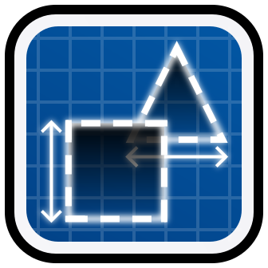

# LayoutGenerator

Procedurally generate Geometry Dash layouts




## Usage

Install the mod with [Geode](https://geode-sdk.org/mods/profdragon.layoutgenerator) or build it manually.

See [about.md](about.md) for instructions on using it.


## Build instructions

For more info, see the [Geode docs](https://docs.geode-sdk.org/getting-started/create-mod#build)
```sh
# Assuming you have the Geode CLI set up already
geode build
```
